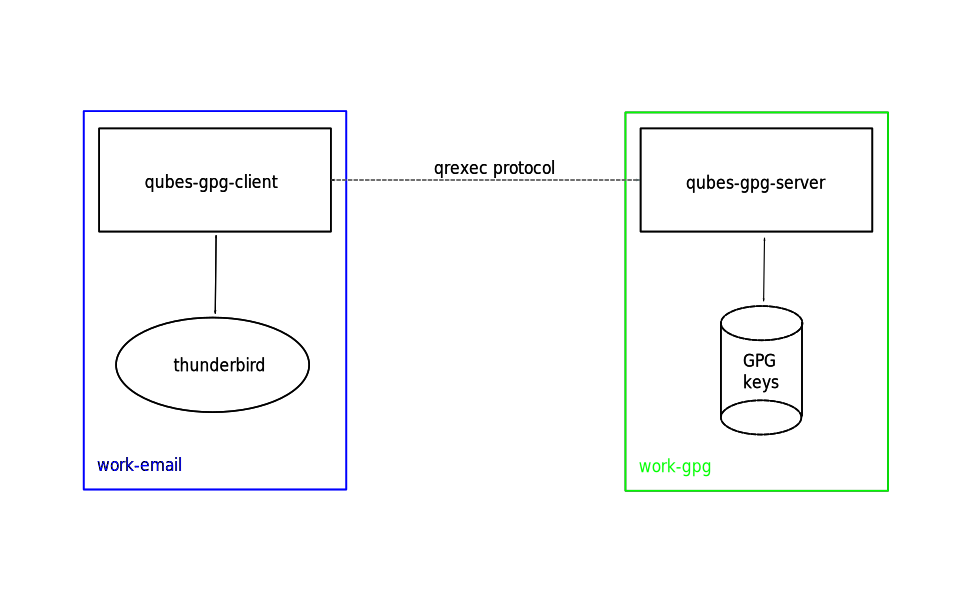
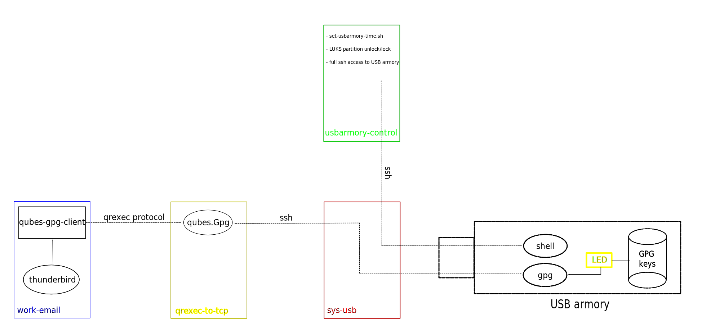

Qubes Split GPG configuration for qubes-gpg-server over TCP
===========================================================

This repository contains [Qubes OS](https://www.qubes-os.org) customizations to
support its [Split GPG](https://www.qubes-os.org/doc/split-gpg/) setup using a
TCP connected qubes-gpg-server.

The scenario is originally created to support Split GPG with the
[USB armory](https://inversepath.com/usbarmory) device acting as GPG server,
however any networked device can be used for this setup.


Qubes Split GPG architecture
============================

The following diagram presents the Split GPG implemented in two VM:


In this setup the following architecture is used:



Qubes OS setup
==============

Place qrexec-to-tcp and usbarmory-ssh salt configuration directories in /srv/salt
on dom0 and enable them:

```
[root@dom0 salt]# qubesctl top.enable qrexec-to-tcp
[root@dom0 salt]# qubesctl top.enable usbarmory-control
[root@dom0 salt]# qubesctl --all state.highstate
```

Generate the required ssh keys:
```
[user@usbarmory-control ~]$ ssh-keygen -f /home/user/.ssh/id_rsa_qubes_ssh
[user@qrexec-to-tcp ~]$ ssh-keygen -f /home/user/.ssh/id_rsa_qubes_gpg
[user@qrexec-to-tcp ~]$ ssh-keygen -f /home/user/.ssh/id_rsa_qubes_import
```

The three public keys should be copied to the VM containing the USB armory
image build. For example:

```
[root@dom0 ~]# qvm-run --pass-io usbarmory-control 'cat /home/user/.ssh/id_rsa_qubes_ssh.pub' > id_rsa_qubes_ssh.pub
[root@dom0 ~]# qvm-run --pass-io qrexec-to-tcp 'cat /home/user/.ssh/id_rsa_qubes_gpg.pub' > id_rsa_qubes_gpg.pub
[root@dom0 ~]# qvm-run --pass-io qrexec-to-tcp 'cat /home/user/.ssh/id_rsa_qubes_import.pub' > id_rsa_qubes_import.pub
[root@dom0 ~]# qvm-copy-to-vm build-vm id_rsa_qubes_*.pub
```

USB armory setup
================

See this [setup guide](https://github.com/inversepath/usbarmory/blob/master/software/buildroot/README-Qubes_Split_GPG.md).


Operation
=========

```
[user@usbarmory-control ~]$ ./set-usbarmory-time.sh
[user@usbarmory-control ~]$ ssh usbarmory
(usbarmory)$ unlock

[user@qrexec-to-tcp ~]$ ssh 10.0.0.1 FIXME
[user@work ~]$ export QUBES_GPG_DOMAIN="qrexec-to-tcp"
[user@work ~]$ wget https://keys.qubes-os.org/keys/qubes-master-signing-key.asc
[user@work ~]$ qubes-gpg-import qubes-master-signing-key.asc
[user@work ~]$ qubes-gpg-client -k
```

TODO
====
- udev rule should be bind to specific USB armory mac address
